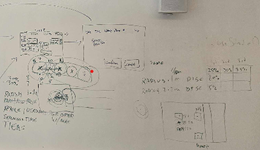
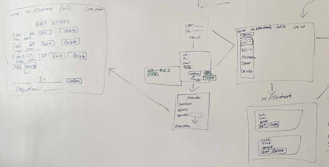
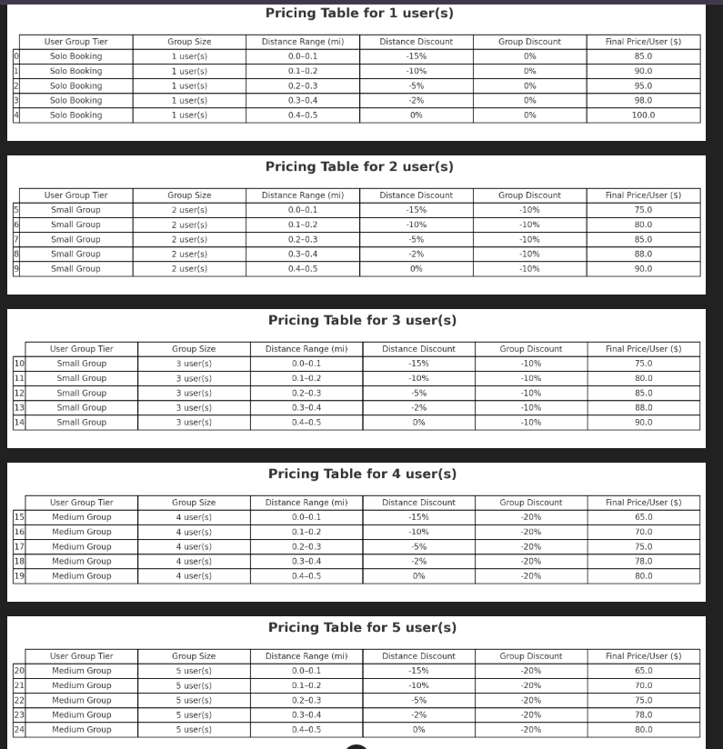
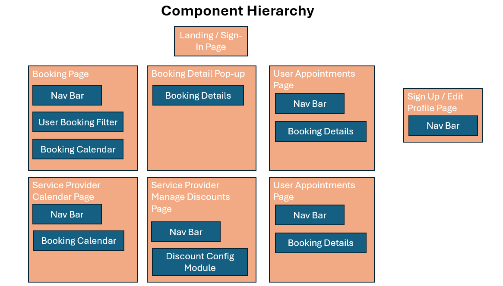
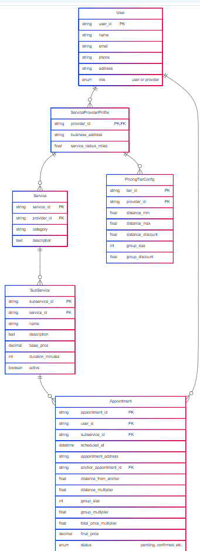

# Viciniti

## Project Description

### Our application is called Viciniti. It matches users who consume delivered services and products with corresponding providers in a way that facilitates piggybacking multiple deliveries together in order to create efficiencies and cost savings for both parties and drive more sales for the providers.

## Application Description

The purpose of the application is to make the delivery of products and services to consumers more efficient by generating orders/appointments that are grouped closely toghther geographically. We do this by pushing disount options to users based on their proximity to existing orders/appointments with a given service/product provider. This allows the providers to generate more business while reducing delivery costs and it allows users to get better pricing.

## User Stories

### MVP Goals

#### For Users
- **Create User Account**
    - As a User, I want to be able to create an account, so that I can save my preferences and personal information.
- **User Log In**
    -As a user, I want to be able to log in to my account, so that I can manage my account and make and manage appointments.
- **View User Profile Details**
    - As a User, I want to be able to view my account details, so that I can know that my account information is accurate.
    - This page can be the same as the create account page, but the fields will be populated with the users saved information and they can edit and resave each field.
- **Edit User Profile Details**
    - As a User, I want to be able to edit my account details, so that I can update any details if they change or fix any errors.
- **Delete User Account**
    - As a User, I want to be able to delete my account, so that I can protect my data and reduce spam communications if I choose to no longer use this application.
    - This feature will be included on the edit account page, it just adds a delete button.
- **Search Available Appointments**
    - As a User, I want to be able to view options for different appointments I can make by filtering a calendar for different types of services
- **View Appointment Details & Confirm Appointment**
    - As a User, I want to be able to view the details of a particular appointment and confirm the appoinment booking.
- **View & Cancel Appointments**
    - As a User, I want to be able to view a list of my appoinment bookings and cancel any appointments from the list.
- **Change Appointments**
    - As a User, I want to be able to change an existing appointment by being taken to the appoinment search calendar filtered for the Service Provider for my existing appointment and when I select and confirm a new appointment my old one is cancelled.
- **Get Discounts**
    - As a User, I want to get discounts on the services I book based on other users within a certain radius booking services with the same Service Provdier.

 #### For Service Providers
- **Create Service Provider Account**
    - As a Service Provider, I want to be able to create an account, so that I can save my preferences and service offering information.
- **Service Provider Log In**
    -As a Service Provider, I want to be able to log in to my account, so that I can manage my account, service offereings and appointments.
- **View Service Provider Profile Details**
    - As a Service Provider, I want to be able to view my account details, so that I can know that my account information is accurate.
    - This page can be the same as the create account page, but the fields will be populated with the users saved information and they can edit and resave each field.
- **Edit Service Provider Profile Details**
    - As a Service Provider, I want to be able to edit my account details, so that I can update any details if they change or fix any errors.
- **Delete Service Provider Account**
    - As a Service Provider, I want to be able to delete my account, so that I can protect my data and reduce spam communications if I choose to no longer use this application.
    - This feature will be included on the edit account page, it just adds a delete button.
- **View, Add, Edit & Delete Service Offerings**
    - As a Service Provider, I want to be able to view the list of services I'm offering and add or remove services and update the service pricing and time 
- **View & Edit Discount Parameters**
    - As a Service Provider, I want to be able to enter and edit the parameters for the discounts I offer on my services based on distance .
- **View Outfit Recommendations**
    - As a user, I want to receive recommendations for outfits to wear based on the items saved in my wardrobe and the weather forecast.
- **Cycle Wardrobe Item Recommendations**
    - As a user, I want to to be able to tell the app that I don't want to wear a particular wardrobe item today and have it cycle that item to another recommendation so I can get to an outfit combination that I like.
- **Cycle Outfit Recommendation**
    - As a user, I want to to be able to:
      * Tell the app that I don't want to wear a recommended outfit today and have it cycle the entire outfit to another recommendation
      * Tell the app that I don't want to wear a recommended outfit ever and have it cycle that entire outfit to another recommendation and save this preference and have it applied to future recommendations
- **View Rated Outfits**
    - As a user, I want to to be able to view all of the outfits I've rated.
- **Edit Rated Outfits**
    - As a user, I want to to be able to edit each of the outfits I've rated.

### Stretch Goals
-**Service Provider Managing Multiple Employees**
    - As a Service Provider, I want to be able to manage appointments for multiple employees at the same time using a separate calendar for each.

- **More Specific Response Options for Recommendations**
    - As a user, when I'm cycling through different outfit options I want to be able to specify whether I'm rejecting a particular wardroom item for today's outfit or I don't like that item in combination with the rest of a recommended outfit so I never want to see that combination again so that I can better refine my future recommendations.
- **Adjust Mix of Recommendations Between Rated and Unrated Outfits**
    - As a user, I want to be able to adjust the mix of outfit recommendations I receive between ones that I've rated and new ones that I haven't rated.
- **Connect Wardrobe Item Creation Function to Web/Internal DB Search for Item**
    - As a user, as I'm creating/editing a wardrobe item I want to be given example items to choose from pulled from the web so that I can select the actual item and have it easily populated with correct information and photo.
- **Wish/Shopping List**
    - As a user, I want to be able to create a wish/shopping list so that I can keep track of items I want to add to my wardrobe and can more easily shop for them.
- **Trip Packing List**
    - As a user, I want to be able to create multi-day sets of outfits so that I can plan my wardrobe over longer periods and can create packing lists when traveling.
- **Cost Per Wear Tracking**
    - As a user, I want to be able to track what I've paid for items in my wardrobe and see the running cost per wear so that my shopping decisions can be better informed.
- **Specific Occasion Filter**
    - As a user, I want to be able to filter my outfit recommendations based on what I have planned for the day so that I get better recommendations more quickly.
- **More Detailed User Profile**
    - As a user, I want to be able to save more information about myself to my profile so that I get better recommendations more quickly.

## Wire Frames

## Component Hierarchy Diagram

## Entity Relationship Diagram (ERD)

## Routing Table

## Pseudocode

## Timeline

| Day        |   | Task                               | Blockers | Notes/ Thoughts |
|------------|---|------------------------------------|----------|-----------------|
| Thursday   |   | Create and present proposal        |          |                 |
| Friday     |   | Create Auth, Routes, Components    |          |                 |
| Saturday   |   | Integrate Front & Back Ends        |          |                 |
| Sunday     |   | Work on Python / React / Styling   |          |                 |
| Monday     |   | Work on Python / React / Styling   |          |                 |
| Tuesday    |   | Test and finalize MVP              |          |                 |
| Wednesday  |   | Work on stretch goals              |          |                 |
| Thursday   |   | Final testing and styling          |          |                 |
| Friday     |   | Present                            |          |                 |
# viciniti-front-end

# Viciniti – Full API Routing Table (Finalized for MVP Logic)

## Auth & Role Setup

| Route | Method | Description | Access |
|-------|--------|-------------|--------|
| `/api/signup` | POST | Create a new user and select role (customer or provider) | Public |
| `/api/login` | POST | Authenticate user and return role info | Public |
| `/api/logout` | POST | Log out user | Authenticated |
| `/api/provider-info` | POST | Step 2: Provider enters business details | Public (after selecting provider role) |

---

## Dashboard Logic (Role-Based)

| Route | Method | Description | Access |
|-------|--------|-------------|--------|
| `/api/dashboard` | GET | If Customer: return service categories. If Provider: return weekly appointment schedule | Authenticated |
| `/api/sub-services?category=Nails` | GET | Return sub-services for selected category (Customer) | Authenticated |
| `/api/available-slots` | POST | Return available time slots for selected sub-service | Authenticated |
| `/api/confirm-appointments` | POST | Confirm and save selected appointments (after selecting time slot) | Authenticated |

---

## Appointments

| Route | Method | Description | Access |
|-------|--------|-------------|--------|
| `/api/appointments` | GET | View customer’s booked appointments | Authenticated (Customer) |
| `/api/appointments/:id` | PUT | Edit a customer’s own appointment | Authenticated (Customer) |
| `/api/appointments/:id` | DELETE | Cancel a customer’s own appointment | Authenticated (Customer) |

---

## Provider Sub-Services Management

| Route | Method | Description | Access |
|-------|--------|-------------|--------|
| `/api/my-services` | GET | Provider views all of *their* sub-services | Authenticated (Provider) |
| `/api/my-services` | POST | Provider adds a new sub-service | Authenticated (Provider) |
| `/api/my-services/:id` | PUT | Edit a sub-service | Authenticated (Provider) |
| `/api/my-services/:id` | DELETE | Delete a sub-service | Authenticated (Provider) |

---

## Notifications

| Route | Method | Description | Access |
|-------|--------|-------------|--------|
| `/api/notifications/subscribe` | POST | Subscribe to provider or service category | Authenticated |
| `/api/notifications` | GET | View user’s notifications | Authenticated |

Note: For customers, the entire booking flow (service → sub-service → schedule → confirm) happens on the same dashboard view using these routes.
